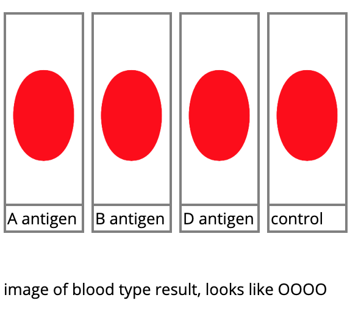
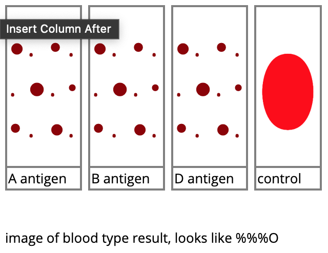
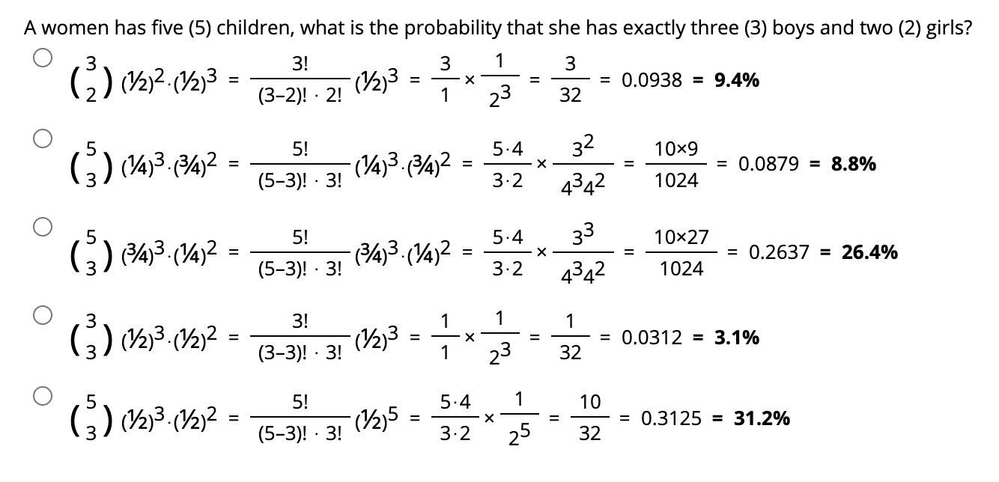
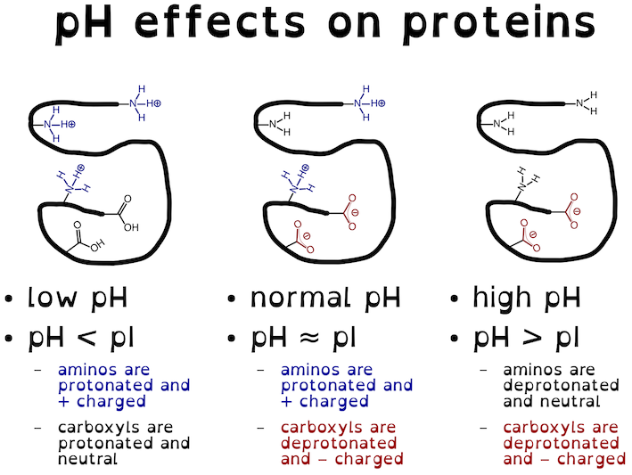
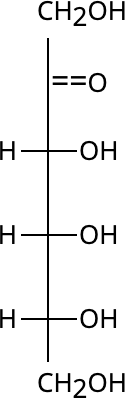
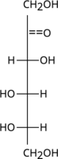
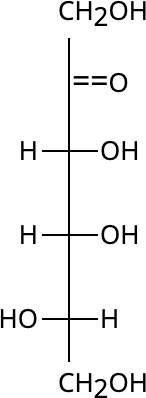
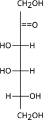
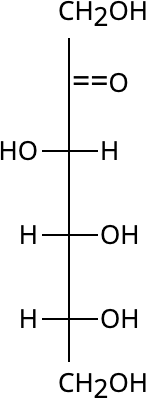
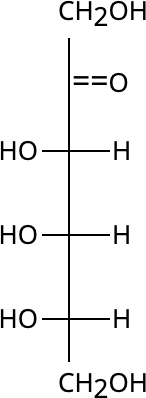

Python Scripts for Generating Biochemistry, Genetics, and Molecular Biology Homework/Quiz problems

[comment]: <> ( https://guides.github.com/features/mastering-markdown/ )
[comment]: <> ( https://docs.github.com/en/free-pro-team@latest/github/creating-cloning-and-archiving-repositories/about-readmes )
[comment]: <> ( https://docs.github.com/en/free-pro-team@latest/github/writing-on-github/basic-writing-and-formatting-syntax )

Table of Contents
=================

   * [Genetics Problems](#genetics-problems)
      * [Blood Types](#blood-types)
         * [blood_type_agglutination_test.py](#blood_type_agglutination_testpy)
         * [blood_type_offspring.py](#blood_type_offspringpy)
         * [blood_type_mother.py](#blood_type_motherpy)
         * [hla_genotype.py](#hla_genotypepy)
      * [Gametes](#gametes)
         * [gametes_unique.py](#gametes_uniquepy)
      * [Epistasis](#epistasis)
         * [epistasis_test_cross.py](#epistasis_test_crosspy)
         * [epistasis_inverse_test_cross.py](#epistasis_inverse_test_crosspy)
      * [X-linked disorders](#x-linked-disorders)
         * [poisson_flies.py](#poisson_fliespy)
      * [Chi-Squared Analysis](#chi-squared-analysis)
         * [Table of Chi-Squared (χ2) Critical Values](#table-of-chi-squared-χ2-critical-values)
         * [chi_square_errors.py](#chi_square_errorspy)
      * [Progeny](#progeny)
         * [probabiliy_of_progeny.py](#probabiliy_of_progenypy)
   * [Biochemistry Problems](#biochemistry-problems)
      * [Isoelectric Point Problems](#isoelectric-point-problems)
         * [isoelectric_one_protein.py](#isoelectric_one_proteinpy)
         * [isoelectric_two_proteins.py](#isoelectric_two_proteinspy)
      * [Gel Migration Problem](#gel-migration-problem)
         * [gel_migration.py](#gel_migrationpy)
      * [Alpha Helix Hydrogen Bonding](#alpha-helix-hydrogen-bonding)
         * [alpha_helix_h-bonds.py](#alpha_helix_h-bondspy)
      * [Hydrophobicity](#hydrophobicity)
         * [which_phobic.py](#which_phobicpy)
      * [Michaelis-Menten](#michaelis-menten)
         * [michaelis_menten_table-Km.py](#michaelis_menten_table-kmpy)
         * [michaelis_menten_table-inhibition.py](#michaelis_menten_table-inhibitionpy)
      * [Enzymes](#enzymes)
         * [chymotrypsin_substrate.py](#chymotrypsin_substratepy)
      * [Sugars](#sugars)
         * [monosaccharide_Fischer_D_to_L_configuration.py](#monosaccharide_fischer_d_to_l_configurationpy)

Created by [gh-md-toc](https://github.com/ekalinin/github-markdown-toc)

# Genetics Problems

## Blood Types

### blood_type_agglutination_test.py

* [Download list of questions in blackboard upload format](blackboard_upload/bbq-blood_type_agglutination_test.txt)

What will the results of a blood test look like for a person with O- blood type?

- [x] A. 
- [ ] B. 

### blood_type_offspring.py

* [Download list of questions in blackboard upload format](blackboard_upload/bbq-blood_type_offspring.txt)

1. For the ABO blood group in humans, the iA and iB alleles are codominant and the i allele is recessive. If a female &female; with <u>type A blood</u> marries a male &male; with <u>type O blood</u>, which of the following blood types could their children possibly have? Check all that apply.

- [x] A. Type O blood
- [x] B. Type A blood
- [ ] C. Type B blood
- [ ] D. Type AB blood

### blood_type_mother.py

* [Download list of questions in blackboard upload format](blackboard_upload/bbq-blood_type_mother.txt)

2. For the ABO blood group in humans, the iA and iB alleles are codominant and the i allele is recessive. A father &male; who has <u>blood type AB</u> has a son &male; who has <u>blood type A</u>, which of the following blood types could the mother &female; possibly have? Check all that apply.

- [x] A. Type O blood
- [x] B. Type A blood
- [x] C. Type B blood
- [x] D. Type AB blood
- [ ] E. None of the above are possible

### hla_genotype.py

* [Download list of 2 gene questions in blackboard upload format](blackboard_upload/bbq-hla_genotypes-2_genes.txt)
* [Download list of 3 gene questions in blackboard upload format](blackboard_upload/bbq-hla_genotypes-3_genes.txt)

3. A mother has a HLA genotype of A2,B5,C6 on one chromosome and A1,B1,C3 on the other. The father has a HLA genotype of A7,B9,C2 on one chromosome and A8,B3,C5 on the other. Which one of the following is a possible genotype for one of their offspring?
- [ ] A. A2,A8,B1,B9,C2,C3
- [ ] B. A1,A2,B1,B5,C3,C6
- [x] C. A2,A7,B5,B9,C2,C6
- [ ] D. A7,A8,B3,B9,C2,C5
- [ ] E. A1,A7,B1,B3,C5,C6

## Gametes

### gametes_unique.py 

* [Download list of questions in blackboard upload format](blackboard_upload/bbq-gametes_unique.txt)

1. How many unique gametes could be produced through independent assortment by an individual with the genotype AA Bb cc dd Ee Ff Gg ?
- [ ] A. 22 = 4
- [ ] B. 23 = 8
- [x] C. 24 = 16
- [ ] D. 25 = 32
- [ ] E. 26 = 64

## Epistasis

### epistasis_test_cross.py

* [Download list of questions in blackboard upload format](blackboard_upload/bbq-epistasis_test_cross.txt)

1. In a specific cross, F2 progeny exhibit a modified dihybrid ratio of <b>15:1</b> (instead of 9:3:3:1 ). What phenotypic ratio would be expected from a test-cross with an individual from the F1 progeny?
- [ ] A. 1:4
- [ ] B. 2:2 or 1:1
- [ ] C. 4:1
- [x] D. 3:1
- [ ] E. 2:1
- [ ] F. 1:3

### epistasis_inverse_test_cross.py

* [Download list of questions in blackboard upload format](blackboard_upload/bbq-epistasis_inverse_test_cross.txt)

2. An F1 heterozygote individual from dihybrid cross is used for a test-cross. The progeny from the test-cross exhibited a modified <b>ratio of 3:1</b> (instead of 1:1:1:1). What phenotypic ratio would be expected in the F2 progeny if the dihybrid cross is continued?
- [x] A. 13:3
- [ ] B. 12:4
- [ ] C. 11:5
- [ ] D. 10:6
- [ ] E. 9:7

## X-linked disorders

### poisson_flies.py

* [Download list of questions in blackboard upload format](blackboard_upload/bbq-poisson_flies.txt)

1. The white-eyed phenotype is an X-linked recessive disorder in fruit flies. The red allele, +, is dominant to the white allele, w. The offspring of size 400 from the mating of a single female and a single male are shown in the table below:

<table><tr><th>phenotype</th><th>female &female;</th><th>male &male;</th></tr> <tr><td>red-eyed (wildtype)</td><td align='center'>0</td><td align='center'>0</td></tr> <tr><td>white-eyed (mutant)</td><td align='center'>185</td><td align='center'>215</td></tr> </table>

<strong>What are the genotypes of the parents in this cross?</strong>

- [ ] A. homozygous wildtype female (++) and male of unknown genotype
- [ ] B. heterozygous female (+w) and wildtype male (+&ndash;)
- [ ] C. heterozygous female (+w) and mutant male (w&ndash;)
- [ ] D. homozygous mutant female (ww) and wildtype male (+&ndash;)
- [x] E. homozygous mutant female (ww) and mutant male (w&ndash;)

## Chi-Squared Analysis

### Table of Chi-Squared (χ2) Critical Values

<table border="1" style="border: 1px solid gray; border-collapse: collapse;"><colgroup width="100"></colgroup> <colgroup width="60"></colgroup> <colgroup width="60"></colgroup> <colgroup width="60"></colgroup> <colgroup width="60"></colgroup> <colgroup width="60"></colgroup> <colgroup width="60"></colgroup> <colgroup width="60"></colgroup> <colgroup width="60"></colgroup>
<tbody>
<tr><th colspan="9" align="center" style="background-color: gainsboro;">Table of Chi-Squared (χ2) Critical Values</th></tr>
<tr><th rowspan="2" align="center" style="background-color: silver;">Degrees of Freedom</th><th colspan="8" align="center" style="background-color: silver;">Probability</th></tr>
<tr><th align="center" style="background-color: gainsboro;">0.95</th><th align="center" style="background-color: gainsboro;">0.90</th><th align="center" style="background-color: gainsboro;">0.75</th><th align="center" style="background-color: gainsboro;">0.50</th><th align="center" style="background-color: gainsboro;">0.25</th><th align="center" style="background-color: gainsboro;">0.10</th><th align="center" style="background-color: gainsboro;">0.05</th><th align="center" style="background-color: gainsboro;">0.01</th></tr>
<tr><th align="center" style="background-color: silver;">1</th>
<td align="center">0.00</td>
<td align="center">0.02</td>
<td align="center">0.10</td>
<td align="center">0.45</td>
<td align="center">1.32</td>
<td align="center">2.71</td>
<td align="center">3.84</td>
<td align="center">6.63</td>
</tr>
<tr><th align="center" style="background-color: silver;">2</th>
<td align="center">0.10</td>
<td align="center">0.21</td>
<td align="center">0.58</td>
<td align="center">1.39</td>
<td align="center">2.77</td>
<td align="center">4.61</td>
<td align="center">5.99</td>
<td align="center">9.21</td>
</tr>
<tr><th align="center" style="background-color: silver;">3</th>
<td align="center">0.35</td>
<td align="center">0.58</td>
<td align="center">1.21</td>
<td align="center">2.37</td>
<td align="center">4.11</td>
<td align="center">6.25</td>
<td align="center">7.81</td>
<td align="center">11.34</td>
</tr>
<tr><th align="center" style="background-color: silver;">4</th>
<td align="center">0.71</td>
<td align="center">1.06</td>
<td align="center">1.92</td>
<td align="center">3.36</td>
<td align="center">5.39</td>
<td align="center">7.78</td>
<td align="center">9.49</td>
<td align="center">13.28</td>
</tr>
</tbody>
</table>

### chi_square_errors.py

* [Download list of questions in blackboard upload format](blackboard_upload/bbq-chi_square_errors.txt)

1. The final result gives the chi-squared (χ2) test value of 3.58 with 3 degrees of freedom. Using the Table of χ2 Critical Values and a level of significance α=0.50, we get a critical value of 2.37. Since the chi-squared (χ2) test value of 3.58 is greater than the critical value of 2.37, the null hypothesis was rejected.

<table border="1" style="border: 1px solid black; border-collapse: collapse;"><colgroup width="160"></colgroup> <colgroup width="80"></colgroup> <colgroup width="80"></colgroup> <colgroup width="100"></colgroup> <colgroup width="80"></colgroup>
<tbody>
<tr><th align="center" style="background-color: lightgray;">Phenotype</th><th align="center" style="background-color: lightgray;">Expected</th><th align="center" style="background-color: lightgray;">Observed</th><th align="center" style="background-color: lightgray;">Calculation</th><th align="center" style="background-color: lightgray;">Statistic</th></tr>
<tr>
<td>Yellow Round (Y–R–)</td>
<td align="center">90</td>
<td align="center">94</td>
<td align="center">(94-90)2⁄ 90</td>
<td align="center">0.178</td>
</tr>
<tr>
<td>Yellow Wrinkled (Y–rr)</td>
<td align="center">30</td>
<td align="center">21</td>
<td align="center">(21-30)2⁄ 30</td>
<td align="center">2.700</td>
</tr>
<tr>
<td>Green Round (yyR–)</td>
<td align="center">30</td>
<td align="center">33</td>
<td align="center">(33-30)2⁄ 30</td>
<td align="center">0.300</td>
</tr>
<tr>
<td>Green Wrinkled (yyrr)</td>
<td align="center">10</td>
<td align="center">12</td>
<td align="center">(12-10)2⁄ 10</td>
<td align="center">0.400</td>
</tr>
<tr>
<td colspan="4" align="right" style="background-color: lightgray;">(sum) χ2 = </td>
<td align="center">3.578</td>
</tr>
</tbody>
</table>

Your lab partner has done a chi-squared (χ2) test for your lab data (above), for the F2 generation in a standard dihybid cross. They wanted to know if the results confirm the expected phenotype ratios, but as usual they did something wrong. <strong>Where did they do wrong?</strong>

- [ ] A. the expected progeny for the null hypothesis is incorrect
- [ ] B. the degrees of freedom is wrong
- [ ] C. the numbers in the calculation have to be squared
- [ ] D. the wrong numbers in the calculation were used for division
- [x] E. the wrong rejection criteria was used

## Progeny

### probabiliy_of_progeny.py

* [Download list of questions in blackboard upload format](blackboard_upload/bbq-probabiliy_of_progeny.txt)

A women has nine (9) children, what is the probability that she has exactly five (5) boys and four (4) girls?

# Biochemistry Problems

## Isoelectric Point Problems

### isoelectric_one_protein.py

<table cellpadding="2" cellspacing="2" style="text-align:center; border: 1px solid black; font-size: 14px;">
<tr><th>Protein Name</th><th>isoelectric point (pI)</th><th>molecular weight</th></tr>
<tr><td>Xylosidase (Xyl)</td><td align="center">5.0</td><td align="center">100.0</td></tr>
</table>

1. The protein in the table (above) is placed in a buffer solution with a pH of 6.0.

What is the correct net charge on the Xyl protein at <b>pH of 6.0</b>?

- [x] A. The protein will have a net negative (&ndash;) charge
- [ ] B. The protein will have a net positive (+) charge
- [ ] C. The protein will have a neutral (0) charge

### isoelectric_two_proteins.py

2. A mixture of two proteins are to be separated by isoelectric focusing.

<table cellpadding="2" cellspacing="2" style="text-align:center; border: 1px solid black; font-size: 14px;">
<tr><th>Protein Name</th><th>isoelectric point (pI)</th><th>molecular weight</th></tr>
<tr><td>&beta;-Galactosidase (Gal)</td><td align="right">4.6</td><td align="right">175.0</td></tr>
<tr><td>Fumerase (Fum)</td><td align="right">7.6</td><td align="right">48.5</td></tr>
</table>

Both protein samples are placed into a gel with a constant pH of 9.0. The gel is then placed into an electric field.

In which direction will each protein in the table migrate at <b>pH 9.0</b>

- [x] A. Both Gal and Fum will travel towards the positive (+) terminal
- [ ] B. Both Gal and Fum will travel towards the negative (&ndash;) terminal
- [ ] C. Gal will travel towards the positive (+)
  and Fum will travel towards the negative (&ndash;)
- [ ] D. Gal will travel towards the negative (&ndash;)
  and Fum will travel towards the positive (+)

## Gel Migration Problem

### gel_migration.py

<table cellpadding="2" cellspacing="2" style="text-align:center; border: 1px solid black; font-size: 14px;">
<tr><th>Protein Name</th><th>Molecular Weight (kDa)</th><th>Migration Distance (cm)</th></tr>
<tr><td>Ribonuclease A (RibA)</td><td align="center">13.7</td><td align="center">3.41</td></tr>
<tr><td>Serine Protease (Ser)</td><td align="center">22.0</td><td align="center">3.03</td></tr>
<tr><td>Prostate-Specific Antigen (PSA)</td><td align="center">30.0</td><td align="center">2.78</td></tr>
<tr><td>Aldolase (Aldo)</td><td align="center">47.5</td><td align="center">2.41</td></tr>
<tr><td>Fibrinogen (Fib)</td><td align="center">63.5</td><td align="center">2.18</td></tr>
<tr><td>Unknown</td><td align="center">?</td><td  align="center">2.89</td></tr>
</table>

3. The standard and unknown proteins listed in the table were run using SDS&ndash;PAGE.

<b>Estimate the molecular weight of the unknown protein.</b>

- [ ] A. 17 kDa
- [x] B. 26 kDa
- [ ] C. 41 kDa
- [ ] D. 54 kDa

## Alpha Helix Hydrogen Bonding

### alpha_helix_h-bonds.py

4. In a long &alpha;-helix, amino acid <b>number 7</b> would form a hydrogen bond with which two other amino acids?

- [ ] A. 1 and 13
- [ ] B. 4 and 10
- [ ] C. 5 and 9
- [ ] D. 2 and 12
- [x] E. 3 and 11

## Hydrophobicity

### which_phobic.py

5. Based on their molecular formula, which one of the following compounds is most likely hydrophobic

- [ ] A. erythrose, C4H8O4
- [ ] B. acetate, C2H3O2
- [x] C. ethylene, CH2CH2
- [ ] D. urea, CO(NH2)2

## Michaelis-Menten

### michaelis_menten_table-Km.py

* [Download list of questions in blackboard upload format](blackboard_upload/bbq-michaelis_menten_table-Km.txt)

6. <b>Michaelis-Menten question.</b> The following question refers to the table (<i>below</i>) of enzyme activity.

<table cellpadding="2" cellspacing="2"  style="text-align:center; border-collapse: collapse; border: 1px solid black; font-size: 14px;"><colgroup width="120"></colgroup> <colgroup width="120"></colgroup>
<tr> <th align="center">substrate concentration [S]</th> <th align="center">initial reaction velocity V0</th></tr>
<tr> <td align="right">0.001&nbsp;</td> <td align="right">30.0&nbsp;</td></tr>
<tr> <td align="right">0.002&nbsp;</td> <td align="right">51.5&nbsp;</td></tr>
<tr> <td align="right">0.005&nbsp;</td> <td align="right">90.0&nbsp;</td></tr>
<tr> <td align="right">0.010&nbsp;</td> <td align="right">120.1&nbsp;</td></tr>
<tr> <td align="right">0.020&nbsp;</td> <td align="right">144.0&nbsp;</td></tr>
<tr> <td align="right">0.050&nbsp;</td> <td align="right">163.7&nbsp;</td></tr>
<tr> <td align="right">0.100&nbsp;</td> <td align="right">171.5&nbsp;</td></tr>
<tr> <td align="right">0.200&nbsp;</td> <td align="right">175.7&nbsp;</td></tr>
<tr> <td align="right">0.500&nbsp;</td> <td align="right">178.3&nbsp;</td></tr>
<tr> <td align="right">1.000&nbsp;</td> <td align="right">179.2&nbsp;</td></tr>
<tr> <td align="right">10.000&nbsp;</td> <td align="right">180.0&nbsp;</td></tr></table>

Using the table (<i>above</i>), calculate the value for the Michaelis-Menten constant, KM.

- [ ] A. KM = 0.001
- [ ] B. KM = 0.002
- [x] C. KM = 0.005
- [ ] D. KM = 0.020
- [ ] E. KM = 0.050

### michaelis_menten_table-inhibition.py

* [Download list of questions in blackboard upload format](blackboard_upload/bbq-michaelis_menten_table-inhibition.txt)

7. <b>Michaelis-Menten question.</b> The following question refers to the table (<i>below</i>) of enzyme activity with and without an inhibitor.

<table cellpadding="2" cellspacing="2"  style="text-align:center; border-collapse: collapse; border: 1px solid black; font-size: 14px;"><colgroup width="160"></colgroup> <colgroup width="160"></colgroup> <colgroup width="160"></colgroup>
<tr> <th align="center">substrate concentration, [S]</th> <th align="center">initial reaction velocity no inhibitor V0 (&ndash;inh)</th> <th align="center">initial reaction velocity with inhibitor V0 (+inh)</th></tr>
<tr> <td align="right">0.0001&nbsp;</td> <td align="right">9.6&nbsp;</td> <td align="right">8.6&nbsp;</td></tr>
<tr> <td align="right">0.0002&nbsp;</td> <td align="right">18.2&nbsp;</td> <td align="right">16.4&nbsp;</td></tr>
<tr> <td align="right">0.0005&nbsp;</td> <td align="right">40.0&nbsp;</td> <td align="right">36.0&nbsp;</td></tr>
<tr> <td align="right">0.0010&nbsp;</td> <td align="right">66.7&nbsp;</td> <td align="right">60.0&nbsp;</td></tr>
<tr> <td align="right">0.0020&nbsp;</td> <td align="right">100.0&nbsp;</td> <td align="right">90.0&nbsp;</td></tr>
<tr> <td align="right">0.0050&nbsp;</td> <td align="right">142.9&nbsp;</td> <td align="right">128.6&nbsp;</td></tr>
<tr> <td align="right">0.0100&nbsp;</td> <td align="right">166.7&nbsp;</td> <td align="right">150.0&nbsp;</td></tr>
<tr> <td align="right">0.0200&nbsp;</td> <td align="right">181.9&nbsp;</td> <td align="right">163.7&nbsp;</td></tr>
<tr> <td align="right">0.0500&nbsp;</td> <td align="right">192.4&nbsp;</td> <td align="right">173.1&nbsp;</td></tr>
<tr> <td align="right">0.1000&nbsp;</td> <td align="right">196.1&nbsp;</td> <td align="right">176.5&nbsp;</td></tr>
<tr> <td align="right">1.0000&nbsp;</td> <td align="right">199.7&nbsp;</td> <td align="right">179.7&nbsp;</td></tr>
<tr> <td align="right">10.0000&nbsp;</td> <td align="right">200.0&nbsp;</td> <td align="right">180.0&nbsp;</td></tr></table>

Using the table (<i>above</i>), determine the type of inhibition.

- [ ] A. anticompetitive
- [ ] B. competitive
- [x] C. noncompetitive
- [ ] D. ultracompetitive
- [ ] E. uncompetitive

## Enzymes

### chymotrypsin_substrate.py

* [Download list of questions in blackboard upload format](blackboard_upload/bbq-chymotrypsin_substrate.txt)

1. Given the following peptide sequence, <b>NH3+&mdash;Gln&mdash;Ala&mdash;Ala&mdash;Tyr&mdash;Ser&mdash;Asn&mdash;Glu&mdash;Glu&mdash;Gln&mdash;Gln&mdash;COO&ndash;</b>, at which peptide bond location will chymotrypsin most likely cleave first?

- [ ] A. Ala&mdash;Tyr
- [x] B. Tyr&mdash;Ser
- [ ] C. Glu&mdash;Gln
- [ ] D. Gln&mdash;Ala
- [ ] E. Ala&mdash;Ala

## Sugars

### monosaccharide_Fischer_D_to_L_configuration.py

* [Download list of questions in blackboard upload format](blackboard_upload/bbq-monosaccharide_Fischer_D_to_L_configuration.txt)

Above is a Fischer projection of the monosaccharide D-tagatose. Which one of the following Fischer projections is of the monosaccharide L-tagatose?

- [ ] A. 
- [ ] B. 
- [ ] C. 
- [ ] D. 
- [x] E. 

