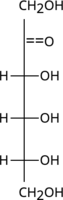
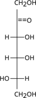
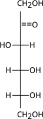

# biology-problems
Collection of Python Scripts for Generating Genetics, Molecular Biology, and Biochemistry Problems

Table of Contents
=================

   * [biochem-problems](#biochem-problems)
      * [Isoelectric Point Problems](#isoelectric-point-problems)
         * [isoelectric_one_protein.py](#isoelectric_one_proteinpy)
         * [isoelectric_two_proteins.py](#isoelectric_two_proteinspy)
      * [Gel Migration Problem](#gel-migration-problem)
         * [gel_migration.py](#gel_migrationpy)
      * [Alpha Helix Hydrogen Bonding](#alpha-helix-hydrogen-bonding)
         * [alpha_helix_h-bonds.py](#alpha_helix_h-bondspy)
      * [Hydrophobicity](#hydrophobicity)
         * [which_phobic.py](#which_phobicpy)
      * [Michaelis-Menten](#michaelis-menten)
         * [michaelis_menten_table-Km.py](#michaelis_menten_table-kmpy)
         * [michaelis_menten_table-inhibition.py](#michaelis_menten_table-inhibitionpy)

## Isoelectric Point Problems

### isoelectric_one_protein.py

<table cellpadding="2" cellspacing="2" style="text-align:center; border: 1px solid black; font-size: 14px;">
<tr><th>Protein Name</th><th>isoelectric point (pI)</th><th>molecular weight</th></tr>
<tr><td>Xylosidase (Xyl)</td><td align="center">5.0</td><td align="center">100.0</td></tr>
</table>

1. The protein in the table (above) is placed in a buffer solution with a pH of 6.0.

What is the correct net charge on the Xyl protein at <b>pH of 6.0</b>?

- [x] A. The protein will have a net negative (&ndash;) charge
- [ ] B. The protein will have a net positive (+) charge
- [ ] C. The protein will have a neutral (0) charge

### isoelectric_two_proteins.py

2. A mixture of two proteins are to be separated by isoelectric focusing.

<table cellpadding="2" cellspacing="2" style="text-align:center; border: 1px solid black; font-size: 14px;">
<tr><th>Protein Name</th><th>isoelectric point (pI)</th><th>molecular weight</th></tr>
<tr><td>&beta;-Galactosidase (Gal)</td><td align="right">4.6</td><td align="right">175.0</td></tr>
<tr><td>Fumerase (Fum)</td><td align="right">7.6</td><td align="right">48.5</td></tr>
</table>

Both protein samples are placed into a gel with a constant pH of 9.0. The gel is then placed into an electric field.

In which direction will each protein in the table migrate at <b>pH 9.0</b>

- [x] A. Both Gal and Fum will travel towards the positive (+) terminal
- [ ] B. Both Gal and Fum will travel towards the negative (&ndash;) terminal
- [ ] C. Gal will travel towards the positive (+)
  and Fum will travel towards the negative (&ndash;)
- [ ] D. Gal will travel towards the negative (&ndash;)
  and Fum will travel towards the positive (+)

## Gel Migration Problem

### gel_migration.py

<table cellpadding="2" cellspacing="2" style="text-align:center; border: 1px solid black; font-size: 14px;">
<tr><th>Protein Name</th><th>Molecular Weight (kDa)</th><th>Migration Distance (cm)</th></tr>
<tr><td>Ribonuclease A (RibA)</td><td align="center">13.7</td><td align="center">3.41</td></tr>
<tr><td>Serine Protease (Ser)</td><td align="center">22.0</td><td align="center">3.03</td></tr>
<tr><td>Prostate-Specific Antigen (PSA)</td><td align="center">30.0</td><td align="center">2.78</td></tr>
<tr><td>Aldolase (Aldo)</td><td align="center">47.5</td><td align="center">2.41</td></tr>
<tr><td>Fibrinogen (Fib)</td><td align="center">63.5</td><td align="center">2.18</td></tr>
<tr><td>Unknown</td><td align="center">?</td><td  align="center">2.89</td></tr>
</table>

3. The standard and unknown proteins listed in the table were run using SDS&ndash;PAGE.

<b>Estimate the molecular weight of the unknown protein.</b>

- [ ] A. 17 kDa
- [x] B. 26 kDa
- [ ] C. 41 kDa
- [ ] D. 54 kDa

## Alpha Helix Hydrogen Bonding

### alpha_helix_h-bonds.py

4. In a long &alpha;-helix, amino acid <b>number 7</b> would form a hydrogen bond with which two other amino acids?

- [ ] A. 1 and 13
- [ ] B. 4 and 10
- [ ] C. 5 and 9
- [ ] D. 2 and 12
- [x] E. 3 and 11

## Hydrophobicity

### which_phobic.py

5. Based on their molecular formula, which one of the following compounds is most likely hydrophobic

- [ ] A. erythrose, C4H8O4
- [ ] B. acetate, C2H3O2
- [x] C. ethylene, CH2CH2
- [ ] D. urea, CO(NH2)2

## Michaelis-Menten

### michaelis_menten_table-Km.py

* [Download list of questions in blackboard upload format](blackboard_upload/bbq-michaelis_menten_table-Km.txt)

6. <b>Michaelis-Menten question.</b> The following question refers to the table (<i>below</i>) of enzyme activity.

<table cellpadding="2" cellspacing="2"  style="text-align:center; border-collapse: collapse; border: 1px solid black; font-size: 14px;"><colgroup width="120"></colgroup> <colgroup width="120"></colgroup>
<tr> <th align="center">substrate concentration [S]</th> <th align="center">initial reaction velocity V0</th></tr>
<tr> <td align="right">0.001&nbsp;</td> <td align="right">30.0&nbsp;</td></tr>
<tr> <td align="right">0.002&nbsp;</td> <td align="right">51.5&nbsp;</td></tr>
<tr> <td align="right">0.005&nbsp;</td> <td align="right">90.0&nbsp;</td></tr>
<tr> <td align="right">0.010&nbsp;</td> <td align="right">120.1&nbsp;</td></tr>
<tr> <td align="right">0.020&nbsp;</td> <td align="right">144.0&nbsp;</td></tr>
<tr> <td align="right">0.050&nbsp;</td> <td align="right">163.7&nbsp;</td></tr>
<tr> <td align="right">0.100&nbsp;</td> <td align="right">171.5&nbsp;</td></tr>
<tr> <td align="right">0.200&nbsp;</td> <td align="right">175.7&nbsp;</td></tr>
<tr> <td align="right">0.500&nbsp;</td> <td align="right">178.3&nbsp;</td></tr>
<tr> <td align="right">1.000&nbsp;</td> <td align="right">179.2&nbsp;</td></tr>
<tr> <td align="right">10.000&nbsp;</td> <td align="right">180.0&nbsp;</td></tr></table>

Using the table (<i>above</i>), calculate the value for the Michaelis-Menten constant, KM.

- [ ] A. KM = 0.001
- [ ] B. KM = 0.002
- [x] C. KM = 0.005
- [ ] D. KM = 0.020
- [ ] E. KM = 0.050

### michaelis_menten_table-inhibition.py

* [Download list of questions in blackboard upload format](blackboard_upload/bbq-michaelis_menten_table-inhibition.txt)

7. <b>Michaelis-Menten question.</b> The following question refers to the table (<i>below</i>) of enzyme activity with and without an inhibitor.

<table cellpadding="2" cellspacing="2"  style="text-align:center; border-collapse: collapse; border: 1px solid black; font-size: 14px;"><colgroup width="160"></colgroup> <colgroup width="160"></colgroup> <colgroup width="160"></colgroup>
<tr> <th align="center">substrate concentration, [S]</th> <th align="center">initial reaction velocity no inhibitor V0 (&ndash;inh)</th> <th align="center">initial reaction velocity with inhibitor V0 (+inh)</th></tr>
<tr> <td align="right">0.0001&nbsp;</td> <td align="right">9.6&nbsp;</td> <td align="right">8.6&nbsp;</td></tr>
<tr> <td align="right">0.0002&nbsp;</td> <td align="right">18.2&nbsp;</td> <td align="right">16.4&nbsp;</td></tr>
<tr> <td align="right">0.0005&nbsp;</td> <td align="right">40.0&nbsp;</td> <td align="right">36.0&nbsp;</td></tr>
<tr> <td align="right">0.0010&nbsp;</td> <td align="right">66.7&nbsp;</td> <td align="right">60.0&nbsp;</td></tr>
<tr> <td align="right">0.0020&nbsp;</td> <td align="right">100.0&nbsp;</td> <td align="right">90.0&nbsp;</td></tr>
<tr> <td align="right">0.0050&nbsp;</td> <td align="right">142.9&nbsp;</td> <td align="right">128.6&nbsp;</td></tr>
<tr> <td align="right">0.0100&nbsp;</td> <td align="right">166.7&nbsp;</td> <td align="right">150.0&nbsp;</td></tr>
<tr> <td align="right">0.0200&nbsp;</td> <td align="right">181.9&nbsp;</td> <td align="right">163.7&nbsp;</td></tr>
<tr> <td align="right">0.0500&nbsp;</td> <td align="right">192.4&nbsp;</td> <td align="right">173.1&nbsp;</td></tr>
<tr> <td align="right">0.1000&nbsp;</td> <td align="right">196.1&nbsp;</td> <td align="right">176.5&nbsp;</td></tr>
<tr> <td align="right">1.0000&nbsp;</td> <td align="right">199.7&nbsp;</td> <td align="right">179.7&nbsp;</td></tr>
<tr> <td align="right">10.0000&nbsp;</td> <td align="right">200.0&nbsp;</td> <td align="right">180.0&nbsp;</td></tr></table>

Using the table (<i>above</i>), determine the type of inhibition.

- [ ] A. anticompetitive
- [ ] B. competitive
- [x] C. noncompetitive
- [ ] D. ultracompetitive
- [ ] E. uncompetitive

## Enzymes

### chymotrypsin_substrate.py

* [Download list of questions in blackboard upload format](blackboard_upload/bbq-chymotrypsin_substrate.txt)

1. Given the following peptide sequence, <b>NH3+&mdash;Gln&mdash;Ala&mdash;Ala&mdash;Tyr&mdash;Ser&mdash;Asn&mdash;Glu&mdash;Glu&mdash;Gln&mdash;Gln&mdash;COO&ndash;</b>, at which peptide bond location will chymotrypsin most likely cleave first?

- [ ] A. Ala&mdash;Tyr
- [x] B. Tyr&mdash;Ser
- [ ] C. Glu&mdash;Gln
- [ ] D. Gln&mdash;Ala
- [ ] E. Ala&mdash;Ala

## Sugars

### monosaccharide_Fischer_D_to_L_configuration.py

* [Download list of questions in blackboard upload format](blackboard_upload/bbq-monosaccharide_Fischer_D_to_L_configuration.txt)

Above is a Fischer projection of the monosaccharide D-tagatose. Which one of the following Fischer projections is of the monosaccharide L-tagatose?

- [ ] A. 
- [ ] B. 
- [ ] C. 
- [ ] D. 
- [x] E. 

# genetics-problems
Python Scripts for Generating Genetics Homework/Quiz problems

## Blood Types

What will the results of a blood test look like for a person with <b>AB+ blood type</b>?

A. <table style="border-collapse: collapse; border: 1px; border-color: black;"><tbody><tr><td style="border: 2px solid gray; align: center;"><table style="border-collapse: collapse; border: 0px solid white;" cellpading="150" cellspacing="150"><tbody><tr><td style="border: 0px solid white;">&#x25CF;</td><td style="border: 0px solid white;">.</td><td style="border: 0px solid white;">&#x25CF;</td><td style="border: 0px solid white;">.</td></tr><tr><td style="border: 0px solid white;">.</td><td style="border: 0px solid white;">&#x25CF;</td><td style="border: 0px solid white;">.</td><td style="border: 0px solid white;">&#x25CF;</td></tr><tr><td style="border: 0px solid white;">&#x25CF;</td><td style="border: 0px solid white;">.</td><td style="border: 0px solid white;">&#x25CF;</td><td style="border: 0px solid white;">.</td></tr></tbody></table></td><td style="border: 0px solid white;"> </td><td style="border: 2px solid gray; align: center;"><table style="border-collapse: collapse; border: 0px solid white;" cellpading="150" cellspacing="150"><tbody><tr><td style="border: 0px solid white;">&#x25CF;</td><td style="border: 0px solid white;">.</td><td style="border: 0px solid white;">&#x25CF;</td><td style="border: 0px solid white;">.</td></tr><tr><td style="border: 0px solid white;">.</td><td style="border: 0px solid white;">&#x25CF;</td><td style="border: 0px solid white;">.</td><td style="border: 0px solid white;">&#x25CF;</td></tr><tr><td style="border: 0px solid white;">&#x25CF;</td><td style="border: 0px solid white;">.</td><td style="border: 0px solid white;">&#x25CF;</td><td style="border: 0px solid white;">.</td></tr></tbody></table></td><td style="border: 0px solid white;"> </td><td style="border: 2px solid gray; align: center;">&#11054;</td><td style="border: 0px solid white;"> </td><td style="border: 2px solid gray; align: center;">&#11054;</td><td style="border: 0px solid white;"> </td><tr><td style="border: 2px solid gray; align: center;">A antigen</td><td style="border: 0px solid white;"> </td><td style="border: 2px solid gray; align: center;">B antigen</td><td style="border: 0px solid white;"> </td><td style="border: 2px solid gray; align: center;">D antigen</td><td style="border: 0px solid white;"> </td><td style="border: 2px solid gray; align: center;">control</td><td style="border: 0px solid white;"> </td></tr></tbody></table>

image of blood type result, looks like %%OO
		

B. <table style="border-collapse: collapse; border: 1px; border-color: black;"><tbody><tr><td style="border: 2px solid gray; align: center;">&#11054;</td><td style="border: 0px solid white;"> </td><td style="border: 2px solid gray; align: center;">&#11054;</td><td style="border: 0px solid white;"> </td><td style="border: 2px solid gray; align: center;"><table style="border-collapse: collapse; border: 0px solid white;" cellpading="150" cellspacing="150"><tbody><tr><td style="border: 0px solid white;">&#x25CF;</td><td style="border: 0px solid white;">.</td><td style="border: 0px solid white;">&#x25CF;</td><td style="border: 0px solid white;">.</td></tr><tr><td style="border: 0px solid white;">.</td><td style="border: 0px solid white;">&#x25CF;</td><td style="border: 0px solid white;">.</td><td style="border: 0px solid white;">&#x25CF;</td></tr><tr><td style="border: 0px solid white;">&#x25CF;</td><td style="border: 0px solid white;">.</td><td style="border: 0px solid white;">&#x25CF;</td><td style="border: 0px solid white;">.</td></tr></tbody></table></td><td style="border: 0px solid white;"> </td><td style="border: 2px solid gray; align: center;"><table style="border-collapse: collapse; border: 0px solid white;" cellpading="150" cellspacing="150"><tbody><tr><td style="border: 0px solid white;">&#x25CF;</td><td style="border: 0px solid white;">.</td><td style="border: 0px solid white;">&#x25CF;</td><td style="border: 0px solid white;">.</td></tr><tr><td style="border: 0px solid white;">.</td><td style="border: 0px solid white;">&#x25CF;</td><td style="border: 0px solid white;">.</td><td style="border: 0px solid white;">&#x25CF;</td></tr><tr><td style="border: 0px solid white;">&#x25CF;</td><td style="border: 0px solid white;">.</td><td style="border: 0px solid white;">&#x25CF;</td><td style="border: 0px solid white;">.</td></tr></tbody></table></td><td style="border: 0px solid white;"> </td><tr><td style="border: 2px solid gray; align: center;">A antigen</td><td style="border: 0px solid white;"> </td><td style="border: 2px solid gray; align: center;">B antigen</td><td style="border: 0px solid white;"> </td><td style="border: 2px solid gray; align: center;">D antigen</td><td style="border: 0px solid white;"> </td><td style="border: 2px solid gray; align: center;">control</td><td style="border: 0px solid white;"> </td></tr></tbody></table>

image of blood type result, looks like OO%%
		

C. <table style="border-collapse: collapse; border: 1px; border-color: black;"><tbody><tr><td style="border: 2px solid gray; align: center;"><table style="border-collapse: collapse; border: 0px solid white;" cellpading="150" cellspacing="150"><tbody><tr><td style="border: 0px solid white;">&#x25CF;</td><td style="border: 0px solid white;">.</td><td style="border: 0px solid white;">&#x25CF;</td><td style="border: 0px solid white;">.</td></tr><tr><td style="border: 0px solid white;">.</td><td style="border: 0px solid white;">&#x25CF;</td><td style="border: 0px solid white;">.</td><td style="border: 0px solid white;">&#x25CF;</td></tr><tr><td style="border: 0px solid white;">&#x25CF;</td><td style="border: 0px solid white;">.</td><td style="border: 0px solid white;">&#x25CF;</td><td style="border: 0px solid white;">.</td></tr></tbody></table></td><td style="border: 0px solid white;"> </td><td style="border: 2px solid gray; align: center;"><table style="border-collapse: collapse; border: 0px solid white;" cellpading="150" cellspacing="150"><tbody><tr><td style="border: 0px solid white;">&#x25CF;</td><td style="border: 0px solid white;">.</td><td style="border: 0px solid white;">&#x25CF;</td><td style="border: 0px solid white;">.</td></tr><tr><td style="border: 0px solid white;">.</td><td style="border: 0px solid white;">&#x25CF;</td><td style="border: 0px solid white;">.</td><td style="border: 0px solid white;">&#x25CF;</td></tr><tr><td style="border: 0px solid white;">&#x25CF;</td><td style="border: 0px solid white;">.</td><td style="border: 0px solid white;">&#x25CF;</td><td style="border: 0px solid white;">.</td></tr></tbody></table></td><td style="border: 0px solid white;"> </td><td style="border: 2px solid gray; align: center;"><table style="border-collapse: collapse; border: 0px solid white;" cellpading="150" cellspacing="150"><tbody><tr><td style="border: 0px solid white;">&#x25CF;</td><td style="border: 0px solid white;">.</td><td style="border: 0px solid white;">&#x25CF;</td><td style="border: 0px solid white;">.</td></tr><tr><td style="border: 0px solid white;">.</td><td style="border: 0px solid white;">&#x25CF;</td><td style="border: 0px solid white;">.</td><td style="border: 0px solid white;">&#x25CF;</td></tr><tr><td style="border: 0px solid white;">&#x25CF;</td><td style="border: 0px solid white;">.</td><td style="border: 0px solid white;">&#x25CF;</td><td style="border: 0px solid white;">.</td></tr></tbody></table></td><td style="border: 0px solid white;"> </td><td style="border: 2px solid gray; align: center;"><table style="border-collapse: collapse; border: 0px solid white;" cellpading="150" cellspacing="150"><tbody><tr><td style="border: 0px solid white;">&#x25CF;</td><td style="border: 0px solid white;">.</td><td style="border: 0px solid white;">&#x25CF;</td><td style="border: 0px solid white;">.</td></tr><tr><td style="border: 0px solid white;">.</td><td style="border: 0px solid white;">&#x25CF;</td><td style="border: 0px solid white;">.</td><td style="border: 0px solid white;">&#x25CF;</td></tr><tr><td style="border: 0px solid white;">&#x25CF;</td><td style="border: 0px solid white;">.</td><td style="border: 0px solid white;">&#x25CF;</td><td style="border: 0px solid white;">.</td></tr></tbody></table></td><td style="border: 0px solid white;"> </td><tr><td style="border: 2px solid gray; align: center;">A antigen</td><td style="border: 0px solid white;"> </td><td style="border: 2px solid gray; align: center;">B antigen</td><td style="border: 0px solid white;"> </td><td style="border: 2px solid gray; align: center;">D antigen</td><td style="border: 0px solid white;"> </td><td style="border: 2px solid gray; align: center;">control</td><td style="border: 0px solid white;"> </td></tr></tbody></table>

image of blood type result, looks like %%%%
		

D. <table style="border-collapse: collapse; border: 1px; border-color: black;"><tbody><tr><td style="border: 2px solid gray; align: center;"><table style="border-collapse: collapse; border: 0px solid white;" cellpading="150" cellspacing="150"><tbody><tr><td style="border: 0px solid white;">&#x25CF;</td><td style="border: 0px solid white;">.</td><td style="border: 0px solid white;">&#x25CF;</td><td style="border: 0px solid white;">.</td></tr><tr><td style="border: 0px solid white;">.</td><td style="border: 0px solid white;">&#x25CF;</td><td style="border: 0px solid white;">.</td><td style="border: 0px solid white;">&#x25CF;</td></tr><tr><td style="border: 0px solid white;">&#x25CF;</td><td style="border: 0px solid white;">.</td><td style="border: 0px solid white;">&#x25CF;</td><td style="border: 0px solid white;">.</td></tr></tbody></table></td><td style="border: 0px solid white;"> </td><td style="border: 2px solid gray; align: center;"><table style="border-collapse: collapse; border: 0px solid white;" cellpading="150" cellspacing="150"><tbody><tr><td style="border: 0px solid white;">&#x25CF;</td><td style="border: 0px solid white;">.</td><td style="border: 0px solid white;">&#x25CF;</td><td style="border: 0px solid white;">.</td></tr><tr><td style="border: 0px solid white;">.</td><td style="border: 0px solid white;">&#x25CF;</td><td style="border: 0px solid white;">.</td><td style="border: 0px solid white;">&#x25CF;</td></tr><tr><td style="border: 0px solid white;">&#x25CF;</td><td style="border: 0px solid white;">.</td><td style="border: 0px solid white;">&#x25CF;</td><td style="border: 0px solid white;">.</td></tr></tbody></table></td><td style="border: 0px solid white;"> </td><td style="border: 2px solid gray; align: center;"><table style="border-collapse: collapse; border: 0px solid white;" cellpading="150" cellspacing="150"><tbody><tr><td style="border: 0px solid white;">&#x25CF;</td><td style="border: 0px solid white;">.</td><td style="border: 0px solid white;">&#x25CF;</td><td style="border: 0px solid white;">.</td></tr><tr><td style="border: 0px solid white;">.</td><td style="border: 0px solid white;">&#x25CF;</td><td style="border: 0px solid white;">.</td><td style="border: 0px solid white;">&#x25CF;</td></tr><tr><td style="border: 0px solid white;">&#x25CF;</td><td style="border: 0px solid white;">.</td><td style="border: 0px solid white;">&#x25CF;</td><td style="border: 0px solid white;">.</td></tr></tbody></table></td><td style="border: 0px solid white;"> </td><td style="border: 2px solid gray; align: center;">&#11054;</td><td style="border: 0px solid white;"> </td><tr><td style="border: 2px solid gray; align: center;">A antigen</td><td style="border: 0px solid white;"> </td><td style="border: 2px solid gray; align: center;">B antigen</td><td style="border: 0px solid white;"> </td><td style="border: 2px solid gray; align: center;">D antigen</td><td style="border: 0px solid white;"> </td><td style="border: 2px solid gray; align: center;">control</td><td style="border: 0px solid white;"> </td></tr></tbody></table>

image of blood type result, looks like %%%O
	

E. <table style="border-collapse: collapse; border: 1px; border-color: black;"><tbody><tr><td style="border: 2px solid gray; align: center;">&#11054;</td><td style="border: 0px solid white;"> </td><td style="border: 2px solid gray; align: center;">&#11054;</td><td style="border: 0px solid white;"> </td><td style="border: 2px solid gray; align: center;">&#11054;</td><td style="border: 0px solid white;"> </td><td style="border: 2px solid gray; align: center;">&#11054;</td><td style="border: 0px solid white;"> </td><tr><td style="border: 2px solid gray; align: center;">A antigen</td><td style="border: 0px solid white;"> </td><td style="border: 2px solid gray; align: center;">B antigen</td><td style="border: 0px solid white;"> </td><td style="border: 2px solid gray; align: center;">D antigen</td><td style="border: 0px solid white;"> </td><td style="border: 2px solid gray; align: center;">control</td><td style="border: 0px solid white;"> </td></tr></tbody></table>

image of blood type result, looks like OOOO
		

F. <table style="border-collapse: collapse; border: 1px; border-color: black;"><tbody><tr><td style="border: 2px solid gray; align: center;">&#11054;</td><td style="border: 0px solid white;"> </td><td style="border: 2px solid gray; align: center;">&#11054;</td><td style="border: 0px solid white;"> </td><td style="border: 2px solid gray; align: center;">&#11054;</td><td style="border: 0px solid white;"> </td><td style="border: 2px solid gray; align: center;"><table style="border-collapse: collapse; border: 0px solid white;" cellpading="150" cellspacing="150"><tbody><tr><td style="border: 0px solid white;">&#x25CF;</td><td style="border: 0px solid white;">.</td><td style="border: 0px solid white;">&#x25CF;</td><td style="border: 0px solid white;">.</td></tr><tr><td style="border: 0px solid white;">.</td><td style="border: 0px solid white;">&#x25CF;</td><td style="border: 0px solid white;">.</td><td style="border: 0px solid white;">&#x25CF;</td></tr><tr><td style="border: 0px solid white;">&#x25CF;</td><td style="border: 0px solid white;">.</td><td style="border: 0px solid white;">&#x25CF;</td><td style="border: 0px solid white;">.</td></tr></tbody></table></td><td style="border: 0px solid white;"> </td><tr><td style="border: 2px solid gray; align: center;">A antigen</td><td style="border: 0px solid white;"> </td><td style="border: 2px solid gray; align: center;">B antigen</td><td style="border: 0px solid white;"> </td><td style="border: 2px solid gray; align: center;">D antigen</td><td style="border: 0px solid white;"> </td><td style="border: 2px solid gray; align: center;">control</td><td style="border: 0px solid white;"> </td></tr></tbody></table>

image of blood type result, looks like OOO%

A. 
<table style="border-collapse: collapse; border: 1px; border-color: black;"><tbody>
<tr>
<td style="border: 2px solid gray; align: center;">&#11054;</td>
<td style="border: 0px solid white;"> </td>
<td style="border: 2px solid gray; align: center;">&#11054;</td>
<td style="border: 0px solid white;"> </td>
<td style="border: 2px solid gray; align: center;">&#11054;</td>
<td style="border: 0px solid white;"> </td>
<td style="border: 2px solid gray; align: center;">&#11054;</td>
<td style="border: 0px solid white;"> </td>
<tr><td style="border: 2px solid gray; align: center;">A antigen</td><td style="border: 0px solid white;"> </td><td style="border: 2px solid gray; align: center;">B antigen</td><td style="border: 0px solid white;"> </td><td style="border: 2px solid gray; align: center;">D antigen</td><td style="border: 0px solid white;"> </td><td style="border: 2px solid gray; align: center;">control</td><td style="border: 0px solid white;"> </td></tr></tbody></table>

image of blood type result, looks like OOOO

B. 
<table style="border-collapse: collapse; border: 1px; border-color: black;"><tbody>
<tr><td style="border: 2px solid gray; align: center;">&#11054;</td><td style="border: 0px solid white;"> </td><td style="border: 2px solid gray; align: center;">&#11054;</td><td style="border: 0px solid white;"> </td><td style="border: 2px solid gray; align: center;">
<table style="border-collapse: collapse; border: 0px solid white;" cellpading="150" cellspacing="150"><tbody>
<tr><td style="border: 0px solid white;">&#x25CF;</td><td style="border: 0px solid white;">.</td><td style="border: 0px solid white;">&#x25CF;</td><td style="border: 0px solid white;">.</td></tr>
<tr><td style="border: 0px solid white;">.</td><td style="border: 0px solid white;">&#x25CF;</td><td style="border: 0px solid white;">.</td><td style="border: 0px solid white;">&#x25CF;</td></tr>
<tr><td style="border: 0px solid white;">&#x25CF;</td><td style="border: 0px solid white;">.</td><td style="border: 0px solid white;">&#x25CF;</td><td style="border: 0px solid white;">.</td></tr></tbody></table></td><td style="border: 0px solid white;"> </td><td style="border: 2px solid gray; align: center;">
<table style="border-collapse: collapse; border: 0px solid white;" cellpading="150" cellspacing="150"><tbody>
<tr><td style="border: 0px solid white;">&#x25CF;</td><td style="border: 0px solid white;">.</td><td style="border: 0px solid white;">&#x25CF;</td><td style="border: 0px solid white;">.</td></tr>
<tr><td style="border: 0px solid white;">.</td><td style="border: 0px solid white;">&#x25CF;</td><td style="border: 0px solid white;">.</td><td style="border: 0px solid white;">&#x25CF;</td></tr>
<tr><td style="border: 0px solid white;">&#x25CF;</td><td style="border: 0px solid white;">.</td><td style="border: 0px solid white;">&#x25CF;</td><td style="border: 0px solid white;">.</td></tr></tbody></table></td><td style="border: 0px solid white;"> </td>
<tr><td style="border: 2px solid gray; align: center;">A antigen</td><td style="border: 0px solid white;"> </td><td style="border: 2px solid gray; align: center;">B antigen</td><td style="border: 0px solid white;"> </td><td style="border: 2px solid gray; align: center;">D antigen</td><td style="border: 0px solid white;"> </td><td style="border: 2px solid gray; align: center;">control</td><td style="border: 0px solid white;"> </td></tr></tbody></table>

image of blood type result, looks like OO%%
		

C. 
<table style="border-collapse: collapse; border: 1px; border-color: black;"><tbody>
<tr><td style="border: 2px solid gray; align: center;">
<table style="border-collapse: collapse; border: 0px solid white;" cellpading="150" cellspacing="150"><tbody>
<tr><td style="border: 0px solid white;">&#x25CF;</td><td style="border: 0px solid white;">.</td><td style="border: 0px solid white;">&#x25CF;</td><td style="border: 0px solid white;">.</td></tr>
<tr><td style="border: 0px solid white;">.</td><td style="border: 0px solid white;">&#x25CF;</td><td style="border: 0px solid white;">.</td><td style="border: 0px solid white;">&#x25CF;</td></tr>
<tr><td style="border: 0px solid white;">&#x25CF;</td><td style="border: 0px solid white;">.</td><td style="border: 0px solid white;">&#x25CF;</td><td style="border: 0px solid white;">.</td></tr></tbody></table></td><td style="border: 0px solid white;"> </td><td style="border: 2px solid gray; align: center;">
<table style="border-collapse: collapse; border: 0px solid white;" cellpading="150" cellspacing="150"><tbody>
<tr><td style="border: 0px solid white;">&#x25CF;</td><td style="border: 0px solid white;">.</td><td style="border: 0px solid white;">&#x25CF;</td><td style="border: 0px solid white;">.</td></tr>
<tr><td style="border: 0px solid white;">.</td><td style="border: 0px solid white;">&#x25CF;</td><td style="border: 0px solid white;">.</td><td style="border: 0px solid white;">&#x25CF;</td></tr>
<tr><td style="border: 0px solid white;">&#x25CF;</td><td style="border: 0px solid white;">.</td><td style="border: 0px solid white;">&#x25CF;</td><td style="border: 0px solid white;">.</td></tr></tbody></table></td><td style="border: 0px solid white;"> </td><td style="border: 2px solid gray; align: center;">
<table style="border-collapse: collapse; border: 0px solid white;" cellpading="150" cellspacing="150"><tbody>
<tr><td style="border: 0px solid white;">&#x25CF;</td><td style="border: 0px solid white;">.</td><td style="border: 0px solid white;">&#x25CF;</td><td style="border: 0px solid white;">.</td></tr>
<tr><td style="border: 0px solid white;">.</td><td style="border: 0px solid white;">&#x25CF;</td><td style="border: 0px solid white;">.</td><td style="border: 0px solid white;">&#x25CF;</td></tr>
<tr><td style="border: 0px solid white;">&#x25CF;</td><td style="border: 0px solid white;">.</td><td style="border: 0px solid white;">&#x25CF;</td><td style="border: 0px solid white;">.</td></tr></tbody></table></td><td style="border: 0px solid white;"> </td><td style="border: 2px solid gray; align: center;">
<table style="border-collapse: collapse; border: 0px solid white;" cellpading="150" cellspacing="150"><tbody>
<tr><td style="border: 0px solid white;">&#x25CF;</td><td style="border: 0px solid white;">.</td><td style="border: 0px solid white;">&#x25CF;</td><td style="border: 0px solid white;">.</td></tr>
<tr><td style="border: 0px solid white;">.</td><td style="border: 0px solid white;">&#x25CF;</td><td style="border: 0px solid white;">.</td><td style="border: 0px solid white;">&#x25CF;</td></tr>
<tr><td style="border: 0px solid white;">&#x25CF;</td><td style="border: 0px solid white;">.</td><td style="border: 0px solid white;">&#x25CF;</td><td style="border: 0px solid white;">.</td></tr></tbody></table></td><td style="border: 0px solid white;"> </td>
<tr><td style="border: 2px solid gray; align: center;">A antigen</td><td style="border: 0px solid white;"> </td><td style="border: 2px solid gray; align: center;">B antigen</td><td style="border: 0px solid white;"> </td><td style="border: 2px solid gray; align: center;">D antigen</td><td style="border: 0px solid white;"> </td><td style="border: 2px solid gray; align: center;">control</td><td style="border: 0px solid white;"> </td></tr></tbody></table>

image of blood type result, looks like %%%%
		

D. 
<table style="border-collapse: collapse; border: 1px; border-color: black;"><tbody>
<tr><td style="border: 2px solid gray; align: center;">
<table style="border-collapse: collapse; border: 0px solid white;" cellpading="150" cellspacing="150"><tbody>
<tr><td style="border: 0px solid white;">&#x25CF;</td><td style="border: 0px solid white;">.</td><td style="border: 0px solid white;">&#x25CF;</td><td style="border: 0px solid white;">.</td></tr>
<tr><td style="border: 0px solid white;">.</td><td style="border: 0px solid white;">&#x25CF;</td><td style="border: 0px solid white;">.</td><td style="border: 0px solid white;">&#x25CF;</td></tr>
<tr><td style="border: 0px solid white;">&#x25CF;</td><td style="border: 0px solid white;">.</td><td style="border: 0px solid white;">&#x25CF;</td><td style="border: 0px solid white;">.</td></tr></tbody></table></td><td style="border: 0px solid white;"> </td><td style="border: 2px solid gray; align: center;">
<table style="border-collapse: collapse; border: 0px solid white;" cellpading="150" cellspacing="150"><tbody>
<tr><td style="border: 0px solid white;">&#x25CF;</td><td style="border: 0px solid white;">.</td><td style="border: 0px solid white;">&#x25CF;</td><td style="border: 0px solid white;">.</td></tr>
<tr><td style="border: 0px solid white;">.</td><td style="border: 0px solid white;">&#x25CF;</td><td style="border: 0px solid white;">.</td><td style="border: 0px solid white;">&#x25CF;</td></tr>
<tr><td style="border: 0px solid white;">&#x25CF;</td><td style="border: 0px solid white;">.</td><td style="border: 0px solid white;">&#x25CF;</td><td style="border: 0px solid white;">.</td></tr></tbody></table></td><td style="border: 0px solid white;"> </td><td style="border: 2px solid gray; align: center;">
<table style="border-collapse: collapse; border: 0px solid white;" cellpading="150" cellspacing="150"><tbody>
<tr><td style="border: 0px solid white;">&#x25CF;</td><td style="border: 0px solid white;">.</td><td style="border: 0px solid white;">&#x25CF;</td><td style="border: 0px solid white;">.</td></tr>
<tr><td style="border: 0px solid white;">.</td><td style="border: 0px solid white;">&#x25CF;</td><td style="border: 0px solid white;">.</td><td style="border: 0px solid white;">&#x25CF;</td></tr>
<tr><td style="border: 0px solid white;">&#x25CF;</td><td style="border: 0px solid white;">.</td><td style="border: 0px solid white;">&#x25CF;</td><td style="border: 0px solid white;">.</td></tr></tbody></table></td><td style="border: 0px solid white;"> </td><td style="border: 2px solid gray; align: center;">&#11054;</td><td style="border: 0px solid white;"> </td>
<tr><td style="border: 2px solid gray; align: center;">A antigen</td><td style="border: 0px solid white;"> </td><td style="border: 2px solid gray; align: center;">B antigen</td><td style="border: 0px solid white;"> </td><td style="border: 2px solid gray; align: center;">D antigen</td><td style="border: 0px solid white;"> </td><td style="border: 2px solid gray; align: center;">control</td><td style="border: 0px solid white;"> </td></tr></tbody></table>

image of blood type result, looks like %%%O
	

E. 
<table style="border-collapse: collapse; border: 1px; border-color: black;"><tbody>
<tr><td style="border: 2px solid gray; align: center;">
<table style="border-collapse: collapse; border: 0px solid white;" cellpading="150" cellspacing="150"><tbody>
<tr><td style="border: 0px solid white;">&#x25CF;</td><td style="border: 0px solid white;">.</td><td style="border: 0px solid white;">&#x25CF;</td><td style="border: 0px solid white;">.</td></tr>
<tr><td style="border: 0px solid white;">.</td><td style="border: 0px solid white;">&#x25CF;</td><td style="border: 0px solid white;">.</td><td style="border: 0px solid white;">&#x25CF;</td></tr>
<tr><td style="border: 0px solid white;">&#x25CF;</td><td style="border: 0px solid white;">.</td><td style="border: 0px solid white;">&#x25CF;</td><td style="border: 0px solid white;">.</td></tr></tbody></table></td><td style="border: 0px solid white;"> </td><td style="border: 2px solid gray; align: center;">
<table style="border-collapse: collapse; border: 0px solid white;" cellpading="150" cellspacing="150"><tbody>
<tr><td style="border: 0px solid white;">&#x25CF;</td><td style="border: 0px solid white;">.</td><td style="border: 0px solid white;">&#x25CF;</td><td style="border: 0px solid white;">.</td></tr>
<tr><td style="border: 0px solid white;">.</td><td style="border: 0px solid white;">&#x25CF;</td><td style="border: 0px solid white;">.</td><td style="border: 0px solid white;">&#x25CF;</td></tr>
<tr><td style="border: 0px solid white;">&#x25CF;</td><td style="border: 0px solid white;">.</td><td style="border: 0px solid white;">&#x25CF;</td><td style="border: 0px solid white;">.</td></tr></tbody></table></td><td style="border: 0px solid white;"> </td><td style="border: 2px solid gray; align: center;">&#11054;</td><td style="border: 0px solid white;"> </td><td style="border: 2px solid gray; align: center;">&#11054;</td><td style="border: 0px solid white;"> </td>
<tr><td style="border: 2px solid gray; align: center;">A antigen</td><td style="border: 0px solid white;"> </td><td style="border: 2px solid gray; align: center;">B antigen</td><td style="border: 0px solid white;"> </td><td style="border: 2px solid gray; align: center;">D antigen</td><td style="border: 0px solid white;"> </td><td style="border: 2px solid gray; align: center;">control</td><td style="border: 0px solid white;"> </td></tr></tbody></table>

image of blood type result, looks like %%OO
		

F. 
<table style="border-collapse: collapse; border: 1px; border-color: black;"><tbody>
<tr><td style="border: 2px solid gray; align: center;">&#11054;</td><td style="border: 0px solid white;"> </td><td style="border: 2px solid gray; align: center;">&#11054;</td><td style="border: 0px solid white;"> </td><td style="border: 2px solid gray; align: center;">&#11054;</td><td style="border: 0px solid white;"> </td><td style="border: 2px solid gray; align: center;">
<table style="border-collapse: collapse; border: 0px solid white;" cellpading="150" cellspacing="150"><tbody>
<tr><td style="border: 0px solid white;">&#x25CF;</td><td style="border: 0px solid white;">.</td><td style="border: 0px solid white;">&#x25CF;</td><td style="border: 0px solid white;">.</td></tr>
<tr><td style="border: 0px solid white;">.</td><td style="border: 0px solid white;">&#x25CF;</td><td style="border: 0px solid white;">.</td><td style="border: 0px solid white;">&#x25CF;</td></tr>
<tr><td style="border: 0px solid white;">&#x25CF;</td><td style="border: 0px solid white;">.</td><td style="border: 0px solid white;">&#x25CF;</td><td style="border: 0px solid white;">.</td></tr></tbody></table></td><td style="border: 0px solid white;"> </td>
<tr><td style="border: 2px solid gray; align: center;">A antigen</td><td style="border: 0px solid white;"> </td><td style="border: 2px solid gray; align: center;">B antigen</td><td style="border: 0px solid white;"> </td><td style="border: 2px solid gray; align: center;">D antigen</td><td style="border: 0px solid white;"> </td><td style="border: 2px solid gray; align: center;">control</td><td style="border: 0px solid white;"> </td></tr></tbody></table>

image of blood type result, looks like OOO%

